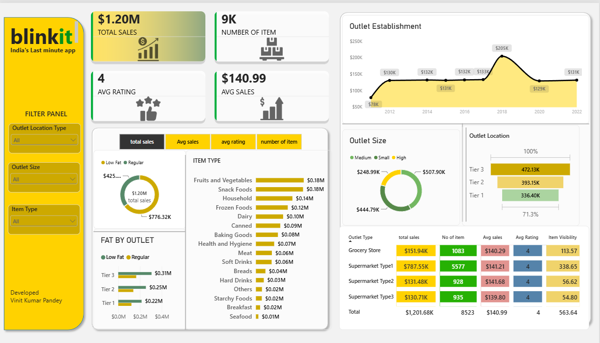

# 🛒 Blinkit Grocery Analysis | Power BI Dashboard

> **An end-to-end business analytics project exploring Blinkit's grocery sales, product performance, and outlet-level trends using SQL and Power BI.**

## 📊 Project Overview

This project analyzes Blinkit's grocery sales data to understand **sales performance, product trends, outlet characteristics, and key business KPIs**.

The goal was to transform raw business data into an **interactive Power BI dashboard** that allows users to explore performance across different dimensions and quickly identify meaningful patterns.

The project demonstrates a complete analytics workflow — from **data analysis and SQL querying to data modeling, DAX, visualization, and interactive dashboard design**.

---

## 🎯 Business Objective

The analysis focuses on answering important business questions such as:

- Which product categories contribute most to overall sales?
- How does sales performance vary across different outlet types?
- How do outlet size and location affect performance?
- Which products and segments show stronger demand?
- How does sales performance change over time?
- What KPIs should stakeholders monitor to evaluate business performance?

---

## 🛠️ Tools & Technologies

| Tool | Purpose |
|---|---|
| **Power BI** | Dashboard development, visualization & reporting |
| **DAX** | KPI calculations and analytical measures |
| **SQL** | Data querying, aggregation & business analysis |
| **Excel** | Data source / initial data handling |
| **Python** | Data analysis & exploration |

---

## 📈 Dashboard Features

### 🔹 KPI Overview

The dashboard provides an at-a-glance view of important business metrics, helping stakeholders quickly understand overall performance.

### 🔹 Sales Analysis

Analysis of sales performance across:

- Item Type
- Fat Content
- Outlet Type
- Outlet Size
- Outlet Location
- Establishment Year

### 🔹 Interactive Filtering

The dashboard includes interactive slicers and a dedicated **filter panel** to allow users to dynamically explore the data.

Users can filter the analysis by dimensions such as:

- Outlet Location
- Outlet Size
- Item Type

### 🔹 Data Visualization

The dashboard uses a combination of:

- KPI Cards
- Bar Charts
- Donut/Pie Charts
- Line Charts
- Tables
- Interactive Slicers

The focus was not only on visualization, but on creating a dashboard that communicates the **business story clearly and efficiently**.

---

## 🧮 SQL Analysis

SQL was used to perform business-focused analysis and extract useful information from the dataset.

The repository includes the SQL queries used during the project:

📄 **`BlinkitQueries.sql`**

These queries support analysis of sales, products, outlets, and other business dimensions.

---

## 📊 Power BI Dashboard

The final dashboard was developed in Power BI with:

- Data modeling
- DAX measures
- KPI cards
- Interactive slicers
- Custom filter panel
- Business-focused visualizations
- Dashboard navigation and user interaction

### Dashboard Preview



---

## 🔍 Key Analytical Areas

The project explores several important dimensions of the Blinkit business:

**Product Performance**
- Item categories
- Fat content
- Product-level sales patterns

**Outlet Performance**
- Outlet type
- Outlet size
- Outlet location
- Establishment year

**Business Performance**
- Total sales
- Average sales
- Item performance
- Customer ratings
- Sales trends

---

## 💡 Key Learnings

This project helped strengthen my practical understanding of:

- Writing business-oriented SQL queries
- Building analytical data models
- Creating DAX measures
- Designing interactive Power BI dashboards
- Using slicers and filter panels effectively
- Converting raw data into meaningful visual insights
- Presenting analytical findings in a stakeholder-friendly format

### The main takeaway

> **A good dashboard is not just a collection of charts — it should help the user understand the business story and make better decisions.**

---

## 📂 Repository Structure

```text
Blinkit-Grocery-Analysis/
│
├── BlinkitQueries.sql
├── Blinkitgrocerydashboard.pbix
├── blinkitdashboard.png
└── README.md
```

---

## 🚀 How to Explore the Project

### 1. Clone or download the repository

```bash
git clone https://github.com/vin9415/Blinkit-Grocery-Analysis.git
```

### 2. Open the Power BI file

Open:

```text
Blinkitgrocerydashboard.pbix
```

using **Power BI Desktop**.

### 3. Explore the dashboard

Use the interactive slicers and filter panel to explore sales and outlet performance across different business dimensions.

### 4. Review the SQL analysis

Open:

```text
BlinkitQueries.sql
```

to explore the SQL queries used for the analysis.

---

## 🎥 Project Walkthrough

A detailed walkthrough of the project is available here:

**[Watch the Project Walkthrough](https://www.youtube.com/watch?v=phs0SLj86ek&t=9209s)**

---

## 👨‍💻 Author

**Vinit Pandey**

Aspiring Data Analyst | SQL | Python | Power BI | Excel

🔗 GitHub: https://github.com/vin9415

---

## ⭐ If you found this project useful

Feel free to **star ⭐ the repository** or connect with me on LinkedIn.

I'm continuously building projects to strengthen my skills in **Data Analytics, Business Intelligence, SQL, Python and Power BI**.

### 🔖 Topics

`power-bi` `sql` `python` `excel` `data-analysis` `data-analytics` `business-intelligence` `data-visualization` `dax` `blinkit` `dashboard` `retail-analytics`